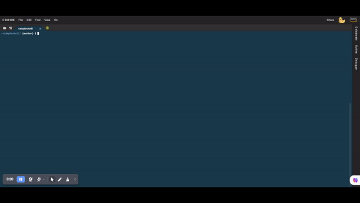

# My shell

Welcome to the My Shell Project! This project aims to provide a simple shell program that mimics the functionality of the Linux shell. With this shell, you can execute commands, navigate directories, and perform various shell operations.
## Demo
Here's a brief demonstration of the Shell Project in action:

## Features
- Command Execution: Execute system commands just like in the Linux shell.
- Navigation: Change directories and explore the file system.
- Environment Variables: Set and manage environment variables within the shell.

## Getting Started

To get started with the Shell Project, follow these steps:

1. Clone the repository to your local machine:
   
   git `clone` <repository_url>
2. Build the shell program by running the following command:

   `make`
  
3. Run the shell:

    `./shell`

## Usage

Once you have the shell up and running, you can start using it to execute commands. Here are some basic commands and operations you can perform:

- Command Execution: Enter a command (e.g., ls, echo Hello, World!) and press Enter to execute it.
- Navigation: Use the cd command to change directories. For example:
  `cd /path/to/directory`

## Contributing

Contributions to the Shell Project are welcome! If you find any issues or have ideas for improvements, please open an issue or submit a pull request on the project's GitHub repository.
